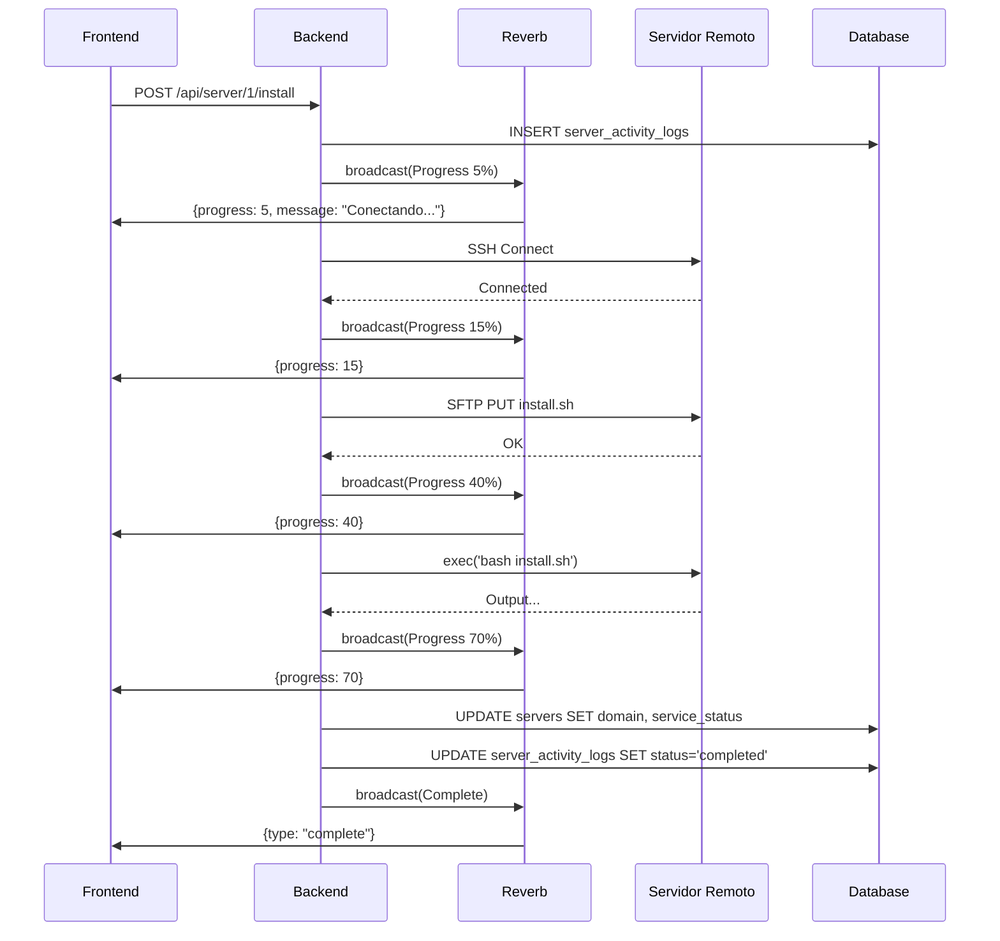
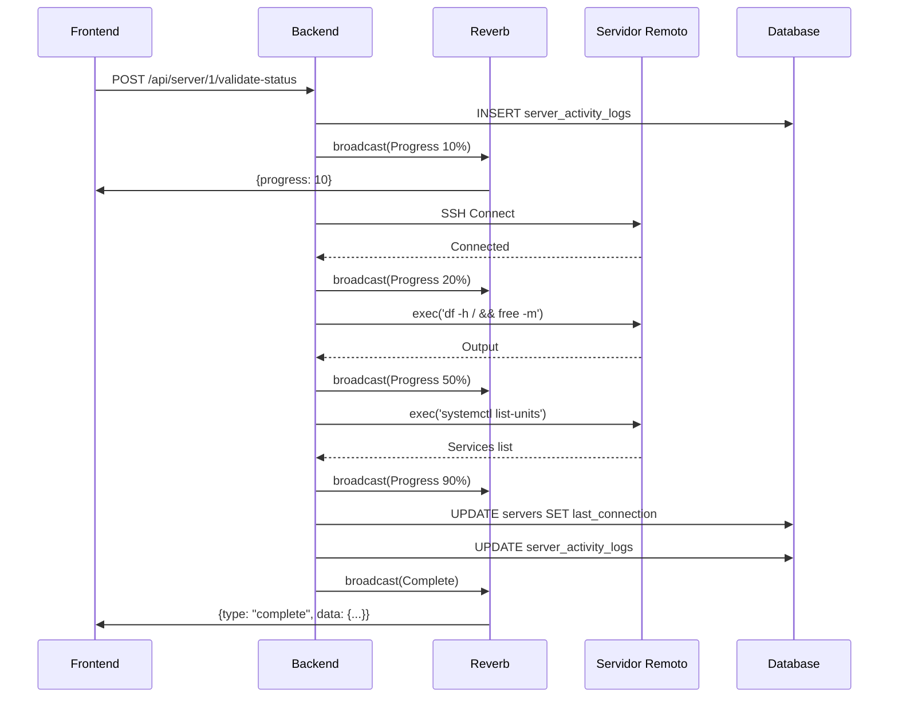

# 🏗️ Arquitectura del Sistema de Gestión de Servidores

## Diagrama de Flujo General

```
┌─────────────┐         ┌──────────────┐         ┌──────────────┐
│   Frontend  │────────▶│   Laravel    │────────▶│   Servidor   │
│   (React)   │  HTTP   │   Backend    │   SSH   │   Remoto     │
└──────┬──────┘         └───────┬──────┘         └──────────────┘
       │                        │
       │      WebSocket         │
       │◀───────────────────────┘
       │   (Laravel Reverb)
       │
       └─ Eventos en tiempo real
```

## Flujo de Operación Detallado

### 1. Petición HTTP Inicial

```
Frontend                     Backend                      Database
   │                           │                             │
   │ POST /api/server/1/install│                             │
   │ {operationId, domain, email}                            │
   ├──────────────────────────▶│                             │
   │                           │ Crear registro en           │
   │                           │ server_activity_logs         │
   │                           ├────────────────────────────▶│
   │                           │                             │
   │                           │ Status: in_progress         │
   │                           │◀────────────────────────────│
   │                           │                             │
   │ 200 OK                    │                             │
   │ {success: true, data}     │                             │
   │◀──────────────────────────│                             │
```

### 2. Broadcasting de Eventos

```
Backend                 Laravel Reverb              Frontend
   │                         │                         │
   │ broadcast(Progress)     │                         │
   ├────────────────────────▶│                         │
   │                         │ Push evento             │
   │                         ├────────────────────────▶│
   │                         │ {type: 'progress',      │
   │                         │  progress: 20,          │
   │                         │  message: '...'}        │
   │                         │                         │
   │ broadcast(Progress)     │                         │
   ├────────────────────────▶│                         │
   │                         │ Push evento             │
   │                         ├────────────────────────▶│
   │                         │ {progress: 50}          │
   │                         │                         │
   │ broadcast(Complete)     │                         │
   ├────────────────────────▶│                         │
   │                         │ Push evento             │
   │                         ├────────────────────────▶│
   │                         │ {type: 'complete'}      │
```

### 3. Conexión SSH al Servidor Remoto

```
Backend                 phpseclib3               Servidor Remoto
   │                         │                         │
   │ connectSSH()            │                         │
   ├────────────────────────▶│                         │
   │                         │ SSH2 Connection         │
   │                         ├────────────────────────▶│
   │                         │                         │
   │                         │ Authenticate            │
   │                         │◀────────────────────────│
   │                         │                         │
   │ Upload script via SFTP  │                         │
   ├────────────────────────▶│                         │
   │                         │ PUT /tmp/script.sh      │
   │                         ├────────────────────────▶│
   │                         │                         │
   │ Execute script          │                         │
   ├────────────────────────▶│                         │
   │                         │ exec('bash script.sh')  │
   │                         ├────────────────────────▶│
   │                         │                         │
   │                         │ Output stream           │
   │                         │◀────────────────────────│
   │ Output                  │                         │
   │◀────────────────────────│                         │
```

## Componentes del Sistema

### Backend (Laravel)

#### 1. **Controlador: ServerController**

- Maneja todas las peticiones HTTP
- Orquesta operaciones SSH
- Emite eventos de broadcasting
- Registra auditoría

#### 2. **Eventos de Broadcasting**

- `ServerActionProgress`: Progreso de operación (0-100%)
- `ServerActionComplete`: Operación completada exitosamente
- `ServerActionError`: Error durante operación

#### 3. **Modelos**

- `Server`: Representa un servidor con sus credenciales
- `ServerActivityLog`: Auditoría de todas las operaciones

#### 4. **Laravel Reverb**

- Servidor WebSocket embebido en Laravel
- Maneja conexiones persistentes
- Distribuye eventos a clientes suscritos

### Frontend (React)

#### 1. **Laravel Echo**

- Cliente WebSocket para Laravel
- Se suscribe a canales específicos
- Escucha eventos de servidor

#### 2. **Hook: useServerOperation**

- Encapsula lógica de operaciones
- Maneja estado (progress, message, error)
- Ejecuta peticiones HTTP

#### 3. **Componentes**

- Formularios de operaciones
- Barras de progreso
- Alertas de éxito/error

### Servidor Remoto

#### 1. **Scripts Bash**

- `install.sh`: Instalación inicial del servidor
- `change-domain.sh`: Cambio de dominio con SSL

#### 2. **SSH/SFTP**

- Puerto 22 (configurable)
- Autenticación con usuario/contraseña

## Flujo de Datos

### 1. Instalación de Servidor



### 2. Validación de Estado



## Estructura de Base de Datos

### Tabla: servers

```sql
+-----------------------+------------------------------------+
| Campo                 | Tipo                               |
+-----------------------+------------------------------------+
| id                    | bigint unsigned                    |
| name                  | varchar(255)                       |
| ip                    | varchar(255)                       |
| username              | varchar(255)                       |
| password              | text (encrypted)                   |
| default_root          | varchar(255)                       |
| port                  | int                                |
| server_os_id          | bigint unsigned                    |
| server_environment_id | bigint unsigned                    |
| description           | text                               |
| active                | tinyint(1)                         |
| last_connection       | timestamp                          |
| notes                 | text                               |
| domain                | varchar(255)                       |
| email                 | varchar(255)                       |
| service_status        | enum('active','inactive','paused') |
| php_version           | varchar(50)                        |
| created_at            | timestamp                          |
| updated_at            | timestamp                          |
+-----------------------+------------------------------------+
```

### Tabla: server_activity_logs

```sql
+----------------+---------------------------------------------+
| Campo          | Tipo                                        |
+----------------+---------------------------------------------+
| id             | bigint unsigned                             |
| operation_id   | varchar(255) INDEXED                        |
| server_id      | bigint unsigned (FK) INDEXED                |
| action         | varchar(100)                                |
| user_id        | bigint unsigned (FK) INDEXED                |
| status         | enum('pending','in_progress',               |
|                |      'completed','failed')                  |
| request_data   | json                                        |
| response_data  | json                                        |
| error_message  | text                                        |
| started_at     | timestamp                                   |
| completed_at   | timestamp                                   |
| created_at     | timestamp                                   |
| updated_at     | timestamp                                   |
+----------------+---------------------------------------------+
```

## Códigos de Error

### HTTP Status Codes

- `200 OK`: Operación exitosa
- `400 Bad Request`: Parámetros inválidos
- `401 Unauthorized`: No autenticado
- `404 Not Found`: Servidor no encontrado
- `500 Internal Server Error`: Error del servidor

### Error Codes (WebSocket)

- `CONNECTION_TIMEOUT`: No se pudo conectar al servidor
- `INVALID_CREDENTIALS`: Credenciales SSH inválidas
- `INSTALLATION_ERROR`: Error durante instalación
- `PROGRAM_INSTALL_ERROR`: Error al instalar programa
- `DOMAIN_CHANGE_ERROR`: Error al cambiar dominio
- `SERVICE_ERROR`: Error con el servicio
- `UNKNOWN_ERROR`: Error desconocido

## Seguridad

### 1. Autenticación

- JWT Bearer Token en todas las peticiones HTTP
- Validación de usuario en cada endpoint

### 2. Autorización

- Verificación de permisos por usuario
- Solo propietarios pueden ejecutar acciones

### 3. Encriptación

- Contraseñas encriptadas con Laravel Crypt
- Comunicación SSH segura

### 4. Rate Limiting

- Máximo 10 operaciones por usuario por minuto
- Prevención de abuso

### 5. Auditoría

- Registro de todas las operaciones con user_id
- Timestamps de inicio y fin
- Captura de errores

## Escalabilidad

### Horizontal

- Laravel Reverb puede escalar con múltiples instancias
- Redis como backend de broadcasting (opcional)
- Load balancer para WebSocket connections

### Vertical

- Queue workers para operaciones pesadas
- Cache de resultados frecuentes
- Optimización de consultas SQL

## Monitoreo

### Métricas Clave

- Tasa de éxito de operaciones
- Tiempo promedio de operaciones
- Conexiones WebSocket activas
- Errores por tipo

### Logs

- Laravel logs: `storage/logs/laravel.log`
- Reverb logs: Output de `php artisan reverb:start`
- Audit logs: `server_activity_logs` table

## Resiliencia

### Manejo de Fallos

- Timeout de 5 minutos por operación
- Retry automático para conexiones SSH
- Rollback en caso de error (cuando aplique)

### Recovery

- Estados guardados en database
- Posibilidad de reanudar operaciones
- Cleanup de operaciones huérfanas

---

## 🎯 Conclusión

El sistema está diseñado para ser:

- **Robusto**: Manejo exhaustivo de errores
- **Escalable**: Soporta múltiples operaciones concurrentes
- **Auditable**: Registro completo de todas las acciones
- **En Tiempo Real**: Feedback instantáneo al usuario
- **Seguro**: Autenticación, autorización y encriptación

La arquitectura modular permite extender fácilmente con nuevas acciones sin modificar el core del sistema.
